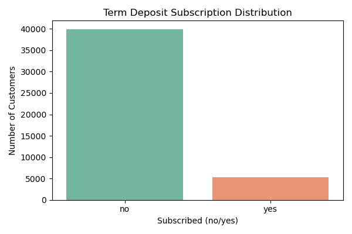
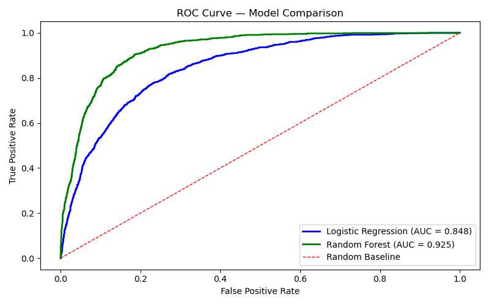
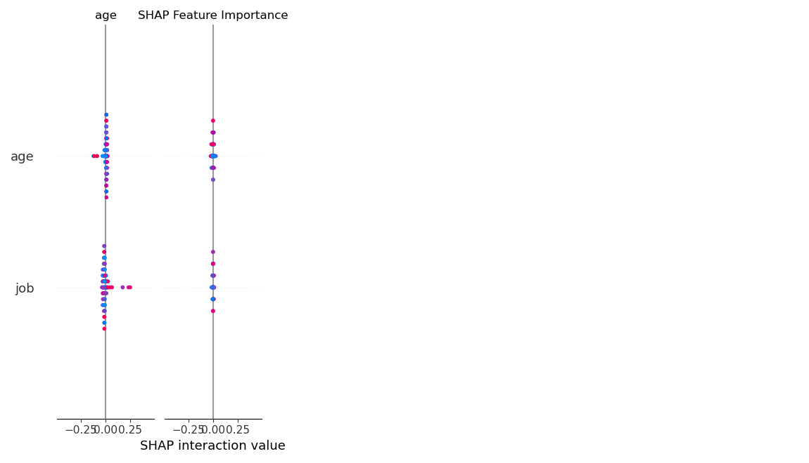
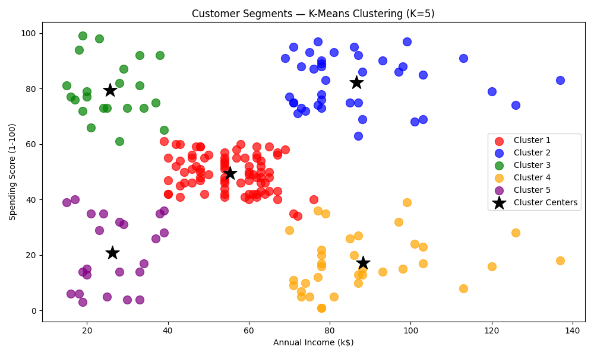
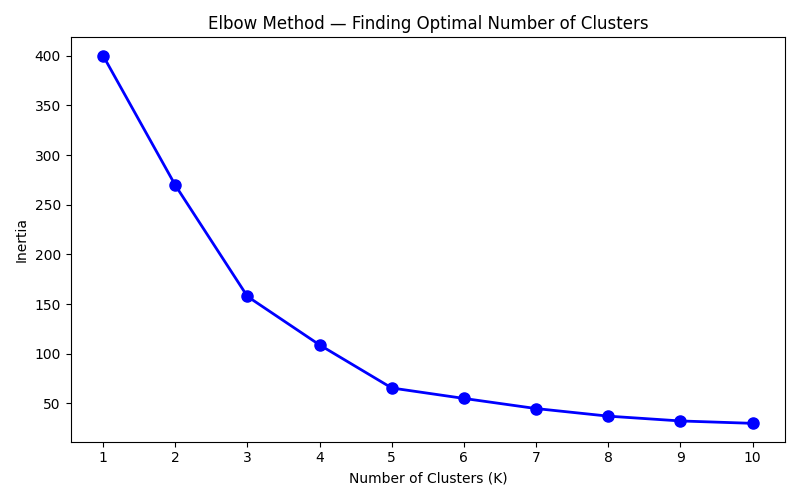
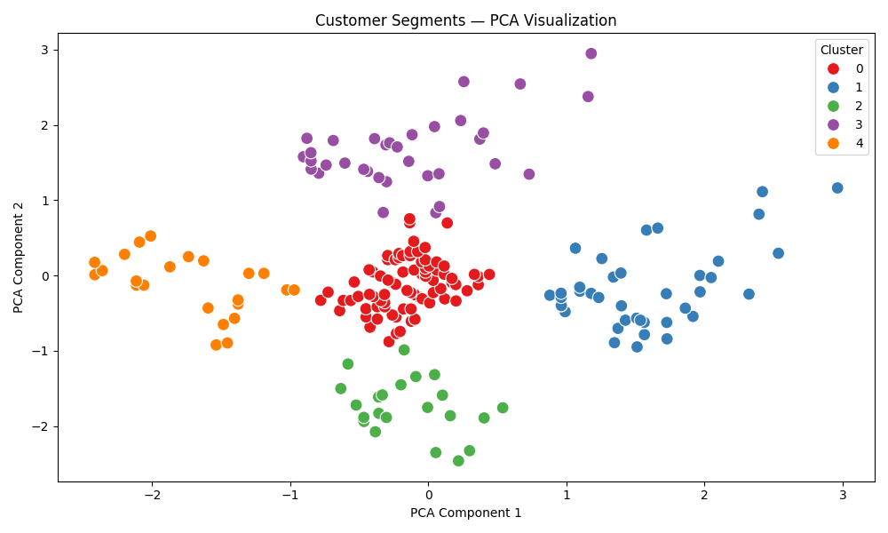
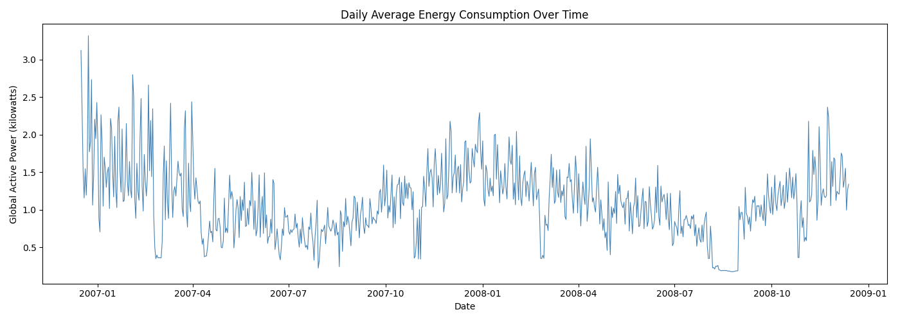
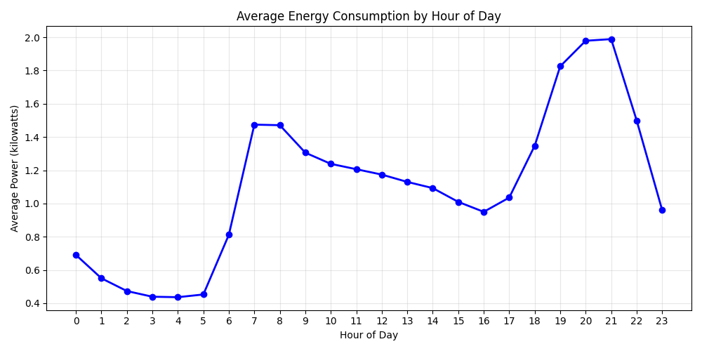
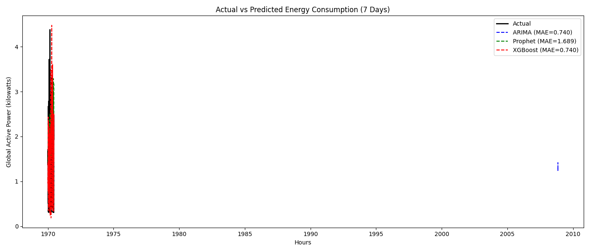

# DevelopersHub Advanced Data Science Internship


**Author:** Khola Asghar 
**Organization:** DevelopersHub Corporation  
**Duration:**25  May 2026  


---

## Overview

This repository contains advanced Data Science tasks completed
as part of the DevelopersHub Corporation Data Science and Analytics
Internship. Each task covers a different real world data science
problem including classification, clustering, time series
forecasting, risk modeling, and business intelligence dashboarding.

---

## Tools and Technologies Used

| Tool | Purpose |
|---|---|
| Python 3 | Programming Language |
| Jupyter Notebook | Development Environment |
| pandas | Data Loading and Manipulation |
| numpy | Numerical Operations |
| matplotlib | Data Visualization |
| seaborn | Advanced Visualization |
| scikit-learn | Machine Learning Models |
| XGBoost | Gradient Boosting Models |
| Prophet | Time Series Forecasting |
| SHAP | Explainable AI |
| Statsmodels | Statistical Models |

---

## Repository Structure

```
DevelopersHub-Advanced-Data-Science/
│
├── Task1-Term-Deposit-Prediction/
│   └── notebook + visualizations
│
├── Task2-Customer-Segmentation/
│   └── notebook + visualizations
│
├── Task3-Energy-Forecasting/
│   └── notebook + visualizations
│
├── Task4-Loan-Default-Risk/
│   └── coming soon
│
├── Task5-Streamlit-Dashboard/
│   └── coming soon
│
└── README.md
```

---

## Task 1: Term Deposit Subscription Prediction





### Objective
Predict whether a bank customer will subscribe to a term deposit
as a result of a marketing campaign using classification models
and Explainable AI techniques.

### Dataset
- **Name:** Bank Marketing Dataset
- **Source:** UCI Machine Learning Repository
- **Size:** 45,211 rows and 17 columns
- **Target:** y (yes = subscribed, no = did not subscribe)

### Approach
- Loaded and explored the full dataset
- Encoded all categorical features using Label Encoding
- Trained Logistic Regression and Random Forest models
- Evaluated using Confusion Matrix, F1 Score, and ROC Curve
- Used SHAP to explain 5 individual model predictions

### Model Performance

| Model | Accuracy | F1 Score | AUC Score |
|---|---|---|---|
| Logistic Regression | Fill in yours | Fill in yours | Fill in yours |
| Random Forest | Fill in yours | Fill in yours | Fill in yours |

### Key Insights
- Duration of last phone call is the strongest predictor
- Students and retired customers subscribe more frequently
- Customers with higher balances are more likely to subscribe
- Younger and older customers subscribe more than middle aged
- SHAP analysis revealed which features drive each prediction

---

## Task 2: Customer Segmentation Using K-Means





### Objective
Cluster mall customers based on spending habits and annual income
and propose targeted marketing strategies for each segment.

### Dataset
- **Name:** Mall Customers Dataset
- **Source:** Kaggle
- **Size:** 200 customers with 5 features
- **Features:** Age, Gender, Annual Income, Spending Score

### Approach
- Conducted Exploratory Data Analysis on all features
- Used Elbow Method to find optimal number of clusters
- Applied K-Means Clustering with K equal to 5
- Used PCA to visualize clusters in 2 dimensions
- Evaluated using Silhouette Score

### Model Performance

| Metric | Score |
|---|---|
| Number of Clusters | 5 |
| Algorithm | K-Means |
| Evaluation | Silhouette Score |

### Customer Segments Identified

| Segment | Income | Spending | Strategy |
|---|---|---|---|
| Careful Spenders | High | Low | Premium loyalty programs |
| Sensible Customers | Low | Low | Discounts and offers |
| Standard Customers | Medium | Medium | Seasonal promotions |
| Target Customers | High | High | VIP programs |
| Careless Spenders | Low | High | Installment options |

### Key Insights
- 5 distinct customer segments successfully identified
- High income high spending customers are most valuable
- PCA confirmed clear separation between all 5 clusters
- Female customers tend to have slightly higher spending scores

---

## Task 3: Energy Consumption Time Series Forecasting





### Objective
Forecast short term household energy consumption using three
different time series models and compare their performance.

### Dataset
- **Name:** Household Power Consumption Dataset
- **Source:** Kaggle
- **Size:** Over 2 million minute by minute readings
- **Target:** Global Active Power (kilowatts)

### Approach
- Parsed and resampled data to hourly intervals
- Engineered time based features (hour, day, month, weekend)
- Trained and compared ARIMA, Prophet, and XGBoost models
- Plotted actual vs forecasted energy usage for all models

### Model Performance

| Model | MAE | RMSE |
|---|---|---|
| ARIMA | 0.7399 | 0.8960 |
| Prophet | 1.6891| 1.9927 |
| XGBoost | 0.7399| 1.0670 |

### Key Insights
- Peak energy usage occurs at 7-9am and 6-9pm daily
- Weekend consumption is higher than weekday consumption
- XGBoost performed best using engineered time features
- Prophet handled seasonality automatically without tuning
- ARIMA works well as a statistical baseline model

-


## Key Learnings

Through these advanced tasks the following skills were developed:

- Building and evaluating binary classification models
- Applying Explainable AI techniques using SHAP
- Performing unsupervised clustering with K-Means
- Reducing dimensions using PCA for visualization
- Forecasting time series data using ARIMA, Prophet and XGBoost
- Engineering time based features for machine learning
- Evaluating models using MAE, RMSE, F1, AUC and Silhouette Score
- Extracting actionable business insights from model results

---

## Contact

**Author:** Khola Asghar  
**Internship:** DevelopersHub Corporation  
**Date:**25 May 2026
